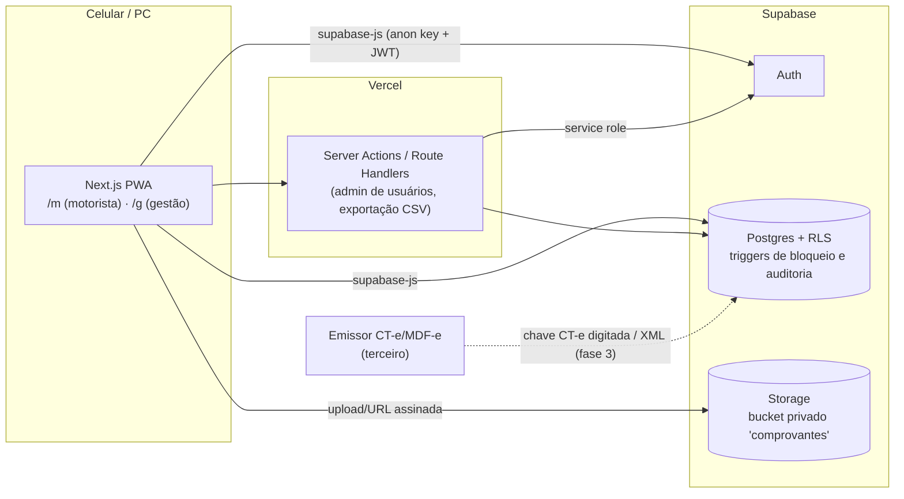

# 02 — Arquitetura

## 1. Visão geral



**Princípio:** o cliente fala direto com o Supabase, e a segurança vem da **RLS + triggers**. Server actions entram só para o que exige a chave de serviço (criar e desativar usuário) ou processamento pesado (exportação).

## 2. Estrutura de pastas

```
.
├── AGENTS.md / CLAUDE.md
├── app/
│   ├── (auth)/login/page.tsx
│   ├── m/                          # área do motorista (mobile-first)
│   │   ├── page.tsx                # home: viagem em andamento + botões grandes
│   │   ├── viagem/nova/page.tsx
│   │   ├── viagem/[id]/page.tsx
│   │   ├── abastecer/page.tsx
│   │   ├── despesa/page.tsx
│   │   └── extrato/page.tsx
│   ├── g/                          # gestão (dono/admin)
│   │   ├── page.tsx                # painel
│   │   ├── viagens/…
│   │   ├── abastecimentos/…        # conferência + anomalias
│   │   ├── acertos/…
│   │   ├── caminhoes/…
│   │   ├── funcionarios/…
│   │   ├── documentos/…
│   │   └── configuracoes/…
│   └── layout.tsx
├── components/
│   ├── ui/                         # shadcn
│   ├── camera/QrScanner.tsx
│   ├── camera/FotoComprovante.tsx
│   └── …
├── lib/
│   ├── supabase/{client.ts,server.ts,middleware.ts}
│   ├── domain/                     # REGRAS PURAS + testes
│   │   ├── dinheiro.ts
│   │   ├── nfce.ts                 # extrair/validar chave
│   │   ├── consumo.ts              # km/L tanque cheio
│   │   ├── anomalias.ts
│   │   ├── comissao.ts
│   │   ├── acerto.ts
│   │   ├── resultado.ts
│   │   └── documentos.ts           # status de vencimento
│   ├── validations/                # schemas Zod
│   └── database.types.ts           # gerado
├── supabase/
│   ├── config.toml
│   ├── migrations/
│   ├── seed.sql
│   └── tests/                      # pgTAP
├── proxy.ts                        # (Next 16: antigo middleware.ts) sessão + redireciona por papel
└── docs/
```

## 3. Autenticação e papéis

- Supabase Auth com e-mail + senha. Sem autocadastro: o signup público fica **desabilitado** no painel do Supabase.
- O gestor cria usuários em `/g/funcionarios` → server action com `service_role` chama `auth.admin.createUser` e insere em `public.profiles` (papel + `funcionario_id`).
- O papel é lido por `public.papel_atual()` (função `security definer`) nas policies. **Não** use `user_metadata` para autorização, porque o próprio usuário pode alterá-lo.
- `proxy.ts` (no Next.js 16 o `middleware.ts` passou a se chamar `proxy.ts`) renova a sessão e redireciona: motorista → `/m`, dono/admin → `/g`. Isso é UX; a segurança real está na RLS.

## 4. Fotos e QR code

**Câmera.** Use `<input type="file" accept="image/*" capture="environment">` para a foto. É o mais compatível com o iOS Safari.

**Compressão.** Feita no cliente, com `browser-image-compression` ou canvas: no máximo 1600 px e qualidade ~0,7. O upload vai para `comprovantes/{funcionario_id}/{yyyy}/{mm}/{uuid}.jpg`.

**Leitura de QR:**
- Use uma biblioteca baseada em ZXing (`@zxing/browser` ou `zxing-wasm`).
- **Não dependa** da `BarcodeDetector` API, porque ela não está disponível no iOS Safari.
- Fallback: ler o QR a partir da própria foto tirada.
- ⚠️ **Validar em iPhone real na Sprint 2** antes de seguir.

**Parsing da chave.** Fica em `lib/domain/nfce.ts` (ver regras, seção 5).

## 5. Tolerância a sinal fraco (RNF-02)

- Formulários do motorista salvam rascunho em `sessionStorage`/`IndexedDB` a cada alteração. É o **único** uso permitido de armazenamento local.
- No envio: mutation com retry (TanStack Query). Em caso de falha, aparece a mensagem "Não enviado — tentar de novo" e o rascunho é mantido.
- A foto é enviada antes do insert. Se o insert falhar, a foto fica órfã; um job de limpeza mensal é aceitável (fase 2).

## 6. PWA

- Serwist (`@serwist/next`): manifest com nome, ícones e `display: standalone`.
- Cache apenas de assets estáticos. **Não** faça cache de respostas da API com dado de negócio.
- No iPhone, a instalação é feita pelo "Adicionar à Tela de Início". Documente esse passo a passo na tela de login.

## 7. Ambientes e deploy

| Ambiente | Front | Banco |
|---|---|---|
| Desenvolvimento | `npm run dev` na máquina do dev | Supabase Cloud, projeto **`gestao-frota-dev`**, plano Free (sem banco local; ver [ADR 0003](adr/0003-banco-somente-nuvem.md)) |
| Produção | Vercel **Hobby** (branch `main`) | Supabase Cloud, plano **Pro** (o plano Free pausa por inatividade e não tem backup adequado) |

**Hospedagem do front (decisão de 2026-09-26):** Vercel Hobby (US$ 0), pois o uso é interno e familiar. Custo total ≈ US$ 25/mês (RNF-04). Os termos da Vercel consideram "comercial" qualquer uso com ganho financeiro, então há risco baixo de o projeto ser questionado. Plano B: migrar para Netlify Free (permite uso comercial) ou Vercel Pro (US$ 20/mês). A troca é barata porque o backend inteiro está no Supabase.

**Migrations:** primeiro no DEV (`npm run db:reset` + `npm run db:test`); depois, em produção, `supabase link` no projeto de produção + `npm run db:push` manual. Produção **nunca** recebe `db:reset` nem seed. No início não há CI aplicando migrations automaticamente.

**CI (GitHub Actions)** em cada PR: `lint`, `typecheck`, `test` e pgTAP. O pgTAP roda com `supabase start` no runner do GitHub, um banco descartável na nuvem do GitHub, e não usa nem o DEV nem a produção.

## 8. Observabilidade mínima

- Erros no cliente: `console.error` + boundary com mensagem amigável. Sentry é opcional na fase 2.
- A tabela `auditoria` responde "quem mudou esse valor?".

## 9. Decisões registradas

- [ADR 0001 — Stack PWA + Supabase](adr/0001-stack.md)
- [ADR 0002 — Fiscal terceirizado](adr/0002-fiscal-terceirizado.md)
- [ADR 0003 — Sem banco local (Supabase Cloud)](adr/0003-banco-somente-nuvem.md)
