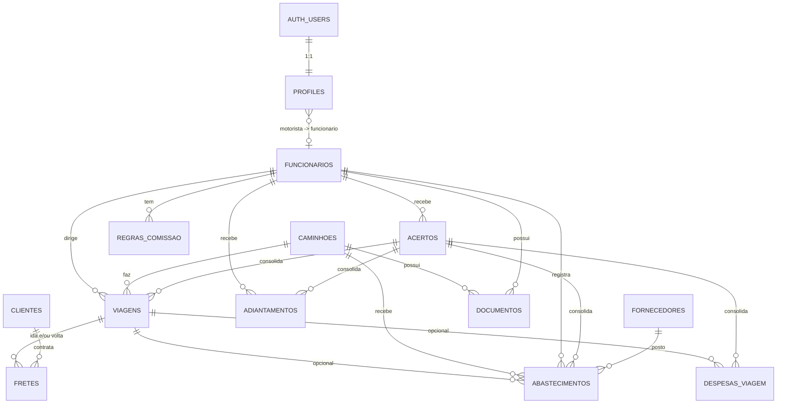

# 03 — Modelo de dados

**Fonte de verdade:** `supabase/migrations/`. Este documento explica o **porquê** do modelo. Se divergir da migration, a migration vale, e este doc deve ser corrigido.

## 1. Diagrama (MVP)



## 2. Tabelas do MVP

| Tabela | Papel | Decisões relevantes |
|---|---|---|
| `profiles` | Liga o usuário do Auth ao papel e ao funcionário | O papel **não** fica em `user_metadata` (o usuário pode editar). Escrita só via service role. Dono/admin pode ter `funcionario_id` (quem também dirige): ganha a área do motorista, e as telas de `/m` filtram explicitamente pelo próprio funcionário |
| `funcionarios` | Pessoa (motorista ou não) | Separada de `profiles`: existe funcionário sem login e login sem funcionário (dono/admin) |
| `caminhoes` | Frota (veículo com motor) | `tipo` `truck` (peça única) ou `cavalo` (cavalo trator, puxa carreta); `configuracao_eixos` em texto livre (toco, truck, 6x2...); `capacidade_tanque_l` alimenta a anomalia de litros; `km_atual` é mantido por trigger; `foto_path` em `comprovantes/caminhoes/{id}/` (leitura para qualquer usuário ativo) |
| `clientes`, `fornecedores` | Cadastros | Fornecedor com `tipo` cobre postos, oficinas e recapadoras (reuso na fase 2). `cnpj` aceita o formato numérico e o **alfanumérico** da Receita (a partir de 07/2026): 12 caracteres `[0-9A-Z]` + 2 DV numéricos; DV conferido em `lib/domain/cnpj.ts` |
| `carretas` | Parte rebocada, com placa própria | `composicao` e `carroceria` em texto livre (a variação é grande), `marca`, `ano`, `eixos` e `eixos_suspensos` digitados à mão, `foto_path` em `comprovantes/carretas/{id}/`. Gestão edita; qualquer usuário ativo lê (o motorista escolhe na viagem) |
| `viagens` | Um **ciclo** SJE → BH → SJE (Q3) | `carreta_id` opcional (truck, ou cavalo sem carreta). Índice único parcial: 1 viagem `em_andamento` por motorista, por caminhão e por carreta. Sem dados comerciais: o motorista registra só caminhão, km e datas |
| `fretes` | Trecho carregado de uma viagem | `sentido` (`ida`/`volta`), único por viagem → 0 a 2 fretes. A volta é sempre carregada; a ida, às vezes. Só gestor lê e escreve (motorista sem policy). Bloqueado se a viagem estiver em acerto fechado |
| `abastecimentos` | Diesel | `nfce_chave` única (antifraude); `tanque_cheio` define a medição de consumo; `forma_pagamento` define se entra no acerto |
| `despesas_viagem` | Pedágio, alimentação etc. | `reembolsavel` define se entra no acerto |
| `adiantamentos` | Dinheiro entregue ao motorista | Só gestor escreve |
| `regras_comissao` | Parâmetros por motorista | Constraint de exclusão impede vigências sobrepostas |
| `acertos` | Fechamento por período | `regra_snapshot` guarda a regra usada (histórico imutável mesmo que a regra mude depois) |
| `documentos` | Vencimentos (empresa, caminhão, carreta ou funcionário) | Histórico: renovação = novo registro; a view `vw_documentos_status` pega o mais recente |
| `configuracoes` | Limiares | Chave/valor JSON, lidos pelas funções de domínio |
| `planos_manutencao` | Itens do plano preventivo por caminhão | Intervalo por km e/ou dias (check exige um dos dois); `ultimo_km`/`ultima_data` atualizados por trigger ao cumprir o item |
| `manutencoes` | Manutenção feita (preventiva/corretiva) | Custo e oficina; o `km` atualiza `caminhoes.km_atual` (mesmo trigger de viagens/abastecimentos); entra no resultado |
| `manutencao_itens` | Itens do plano cumpridos numa manutenção | PK (manutencao_id, plano_id) |
| `despesas_pessoais` | Controle pessoal do motorista (opcional) | Só o próprio lê/escreve (RLS sem policy de gestor); `funcionario_id` forçado por trigger. Fora do acerto e do resultado |
| `pracas_pedagio`, `tarifas_pedagio` | Praças da rota e tarifa por eixo com histórico | Reajuste = nova linha (`vigencia_inicio`); só gestão |
| `cobrancas_pedagio` | O que o app de pedágio cobrou por passagem | Única por (viagem, praça, sentido); `situacao` conferido/contestar/contestado/ressarcido; só gestão. `caminhoes.eixos_suspensos` e `viagens.eixos_ida/volta` (exceção; motorista não altera) alimentam o previsto |
| `multas` | Infrações | `funcionario_id` sugerido pela viagem em curso; `prazo_indicacao` = notificação + `multa_prazo_indicacao_dias`. Só gestor (motorista sem acesso) |
| `auditoria` | Log | Gravada por trigger `security definer`; ninguém escreve direto |

### Por que as anomalias não são colunas

As anomalias são **derivadas** do histórico e dos limiares, que podem mudar. Gravá-las criaria dado desatualizado e daria ao motorista um campo para "limpar". Elas são calculadas em `lib/domain/anomalias.ts` sobre a consulta.

### Garantias no banco (não só na UI)

| Garantia | Mecanismo |
|---|---|
| Motorista não vê dados de outro | RLS |
| Motorista não define frete, cliente, CT-e, conferência nem acerto | Triggers `proteger_*_motorista` |
| Item de acerto fechado é imutável | Trigger `bloquear_item_acertado` |
| Só o dono reabre acerto; acerto pago é imutável | Trigger `validar_transicao_acerto` |
| Nota fiscal não é usada duas vezes | `unique (nfce_chave)` |
| Km coerente | Checks + trigger de `km_atual` |

## 3. Views

| View | Uso |
|---|---|
| `vw_viagens_resumo` | Viagem + km rodado + pedágio + outras despesas + abastecimentos vinculados |
| `vw_documentos_status` | Documento mais recente por entidade/tipo + `dias_para_vencer` |

As duas views usam `security_invoker = true`, então respeitam a RLS de quem consulta. O cálculo de resultado (com rateio de diesel) e o de comissão ficam em TypeScript (`lib/domain/`), para serem testáveis e ficarem num só lugar.

## 4. Fase 2 (não migrar ainda)

Esboço para orientar decisões do MVP. Os nomes podem mudar.

```
pneus (id, marca_fogo UNIQUE, dot, marca, modelo, medida, valor_compra_centavos,
       nf_compra, fornecedor_id, vida_atual smallint default 0,
       status enum(estoque, montado, em_recapagem, descartado), motivo_descarte, ...)

montagens_pneu (id, pneu_id, caminhao_id, posicao text, km_montagem int,
                km_retirada int null, data_montagem, data_retirada, sulco_mm_retirada)
  -- unique parcial: (caminhao_id, posicao) where km_retirada is null
  -- unique parcial: (pneu_id) where km_retirada is null

eventos_pneu (id, pneu_id, tipo enum(compra, recapagem_envio, recapagem_retorno,
              conserto, aferição, descarte), data, custo_centavos, fornecedor_id, sulco_mm, obs)

itens_estoque (id, codigo, descricao, unidade, estoque_minimo)
movimentos_estoque (id, item_id, tipo enum(entrada, saida, ajuste), quantidade,
                    custo_unit_centavos, caminhao_id, manutencao_id, nf, data)


lancamentos_financeiros (id, tipo enum(pagar, receber), categoria, descricao,
                         valor_centavos, vencimento, pago_em, caminhao_id, viagem_id,
                         cliente_id, fornecedor_id)

checklists (id, viagem_id, caminhao_id, motorista_id, respostas jsonb, fotos text[], data)
```

**Impacto no MVP:** nenhum. Não é preciso criar colunas agora. Só mantenha `fornecedores.tipo` e `caminhoes.configuracao_eixos`, que já existem.
